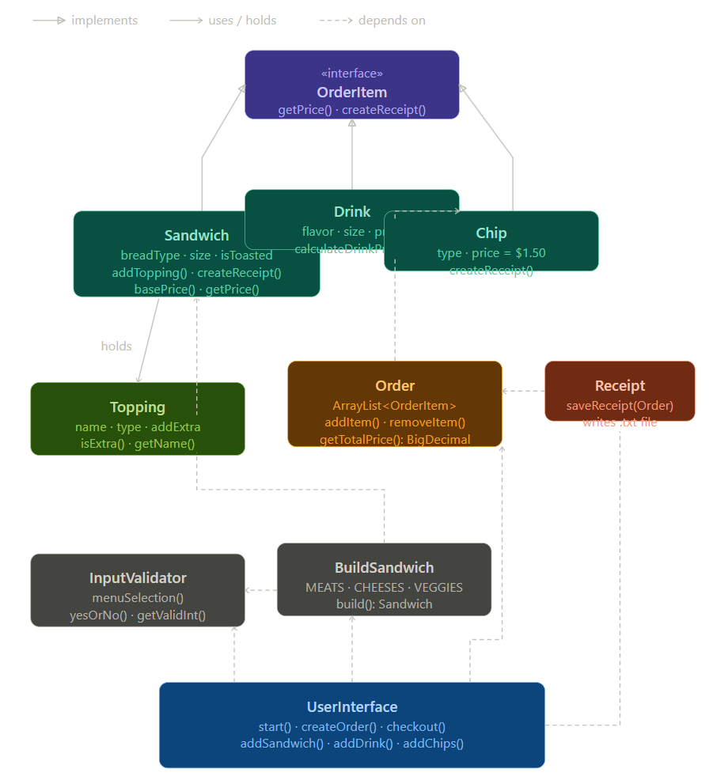

# 🦆 BreadWinner Sandwiches

> *Soggy Bottom Boys Approved* 🍞💨

Inspired by the Nickelodeon show **Breadwinners** — where two ducks deliver bread across Pondgea — BreadWinner Sandwiches brings that same energy to your lunch order. No rocket duck vans required, just great sandwiches.

A Java console-based point-of-sale application where customers can build fully custom sandwiches, add drinks and chips, review their order, and walk away with a receipt. Soggy Bottom Boys approved.

---

## 📋 Table of Contents

- [Inspiration](#inspiration)
- [Features](#features)
- [Project Structure](#project-structure)
- [OOP Concepts](#oop-concepts-used)
- [Pricing](#pricing)
- [How to Run](#how-to-run)
- [Usage](#usage)
- [Receipt Example](#receipt-example)
- [Testing](#testing)
- [Core Classes](#core-classes)
- [Future Improvements](#future-improvements)
- [Built With](#built-with)

---


## 🦆 Inspiration

The name **BreadWinner** comes from the Nickelodeon animated show *Breadwinners*, where two ducks named SwaySway and Buhdeuce deliver bread across the fictional land of Pondgea in a rocket-powered van. The show's chaotic energy, love of bread, and duck-themed everything felt like the perfect vibe for a sandwich shop application.

The duck emojis, bread loaf icons, delivery van, and "Soggy Bottom Boys Approved" receipt footer are all nods to the show. If SwaySway and Buhdeuce ran a deli, this would be their POS system.

---

## ✨ Features

- **Custom sandwich builder** — choose bread, size, toppings, and sauces
- **Full topping menu** — meats, cheeses, veggies, sauces, and sides
- **Extra portions** — add extra meat or cheese for an additional charge
- **Drinks and chips** — add sides to your order
- **Order review** — see your full order before confirming
- **Remove items** — made a mistake? Remove any item before checkout
- **Receipt system** — all orders saved to a daily receipt file
- **Breadwinner theme** — duck emojis, ANSI colors, and ASCII art 🦆

---

## 🏗️ Project Structure

```text
BreadWinner-capstone/
│
├── src/
│   ├── main/
│   │   └── java/com/pluralsight/
│   │       ├── Application.java          ← Entry point
│   │       │
│   │       ├── models/
│   │       │   ├── OrderItem.java        ← Interface: getPrice(), createReceipt()
│   │       │   ├── Sandwich.java         ← Core sandwich with pricing logic
│   │       │   ├── Topping.java          ← Individual topping
│   │       │   ├── Drink.java            ← Drink with size-based pricing
│   │       │   ├── Chip.java             ← Chips with flat price
│   │       │   └── Order.java            ← Holds all items, calculates total
│   │       │
│   │       ├── ui/
│   │       │   └── UserInterface.java    ← All menus and screen flow
│   │       │
│   │       └── util/
│   │           ├── BuildSandwich.java    ← Sandwich building logic
│   │           ├── InputValidator.java   ← Reusable input helpers
│   │           ├── Receipt.java          ← File I/O, daily receipt file
│   │           └── Theme.java            ← Colors, emojis, banner display
│   │
│   └── test/
│       └── java/com/pluralsight/
│           ├── ChipsTest.java
│           ├── DrinksTest.java
│           ├── OrderTests.java
│           ├── ReceiptTest.java
│           └── SandwichTests.java
│
├── receipts/
├── diagrams/
│   └── class-diagram.png
├── pom.xml
└── README.md
```

---

## 🎯 OOP Concepts Used

| Concept | Where |
|---|---|
| **Encapsulation** | All fields `private` with getters/setters |
| **Interface** | `OrderItem` enforces `getPrice()` and `createReceipt()` on all items |
| **Polymorphism** | `Order` holds `ArrayList<OrderItem>` — treats `Sandwich`, `Drink`, `Chip` identically |
| **Separation of Concerns** | Models handle data, UI handles display, util handles helpers |
| **Input Validation** | `IllegalArgumentException` thrown for null/invalid constructor args |
| **BigDecimal** | Used for order totals to avoid floating point rounding errors |

---

## 💰 Pricing

### Sandwiches

| Item | 4" | 8" | 12" |
|---|---|---|---|
| Bread | $5.50 | $7.00 | $8.50 |
| Meat | $1.00 | $2.00 | $3.00 |
| Extra Meat | $0.50 | $1.00 | $1.50 |
| Cheese | $0.75 | $1.50 | $2.25 |
| Extra Cheese | $0.30 | $0.60 | $0.90 |
| Veggies / Sauces | Free | Free | Free |

### Sides

| Item | Price |
|---|---|
| Drink (small) | $2.00 |
| Drink (medium) | $2.50 |
| Drink (large) | $3.00 |
| Chips | $1.50 |

---

## 🚀 How to Run

**Requirements:** Java 17+ and Maven

```bash
git clone https://github.com/YOUR_USERNAME/BreadWinner-capstone.git
cd BreadWinner-capstone
mvn compile exec:java
```

Or run `Application.java` directly from IntelliJ using the green play button.

Receipts are saved to the `receipts/` folder as daily `.txt` files.

---

## 📱 Usage

### Home Screen
```
1. Create New Order
0. Exit
```

### Order Menu
```
1. Add Sandwich
2. Add Drink
3. Add Chips
4. Checkout
5. Remove Item
0. Cancel Order
```

### Sandwich Builder
```
Select bread → Enter size → Toast? → Add toppings → Done
```

### Checkout
Review your full order, confirm, and receive a receipt in the terminal. The receipt is also saved automatically.

---

## 📁 Receipt Example

```
BREADWINNER - 2:45 PM
========================================
Sandwich: 8" white (Toasted)
  - bacon (extra)
  - cheddar
  - onions (extra)
  - mayo
  Subtotal: $11.50
DRINK - Coke (medium) - $2.50
CHIPS - BBQ - $1.50
========================================
TOTAL: $15.50

Thank you for visiting BreadWinner! 🦆🍞
```

---

## 🧪 Testing

21+ unit tests covering:
- Base prices for all sandwich sizes
- Meat and cheese pricing with extras
- Free topping validation
- Order total calculation with `BigDecimal`
- Receipt file creation and content verification
- Input validation and exception throwing
- Order item removal

---

## 🧩 Core Classes

| Class | Package | Purpose |
|---|---|---|
| `Application` | root | Entry point — starts the UI |
| `OrderItem` | models | Interface — contract for all orderable items |
| `Sandwich` | models | Custom sandwich with pricing logic |
| `Topping` | models | Individual topping with type and extra flag |
| `Drink` | models | Drink with size-based price calculation |
| `Chip` | models | Chips with flat $1.50 price |
| `Order` | models | Holds all items, calculates `BigDecimal` total |
| `UserInterface` | ui | All menus, screen flow, checkout |
| `BuildSandwich` | util | Walks user through sandwich customization |
| `InputValidator` | util | Reusable input helpers — menus, yes/no, integers |
| `Receipt` | util | Writes daily receipt file, displays in terminal |
| `Theme` | util | ANSI colors, emojis, banner and border printing |

---

## 📐 Class Diagram



---

## 🔮 Future Improvements

- Signature sandwiches (BLT, Philly Cheese Steak) via inheritance
- Inventory system — track topping stock, show `[SOLD OUT]`
- Quantity tracking — group duplicate items on receipt
- Topping removal from individual sandwiches
- Online ordering support
- Editing the order post confirmation, instead of cancelling the whole order
---

## 🛠️ Technologies

- Java 26
- Maven
- JUnit 5
- IntelliJ IDEA

---

## 📄 License

This project is intended for educational purposes. 
Free to modify and distribute for learning and portfolio use.

---

*BreadWinner Sandwiches — Because every sandwich tells a story* 🦆
